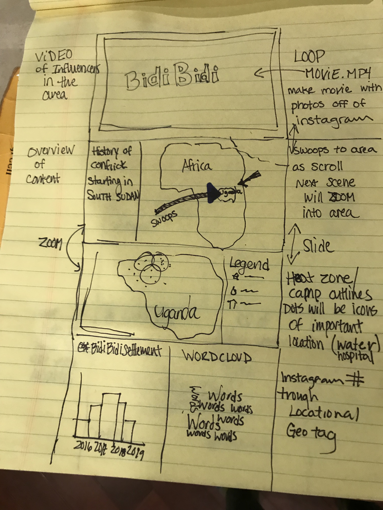
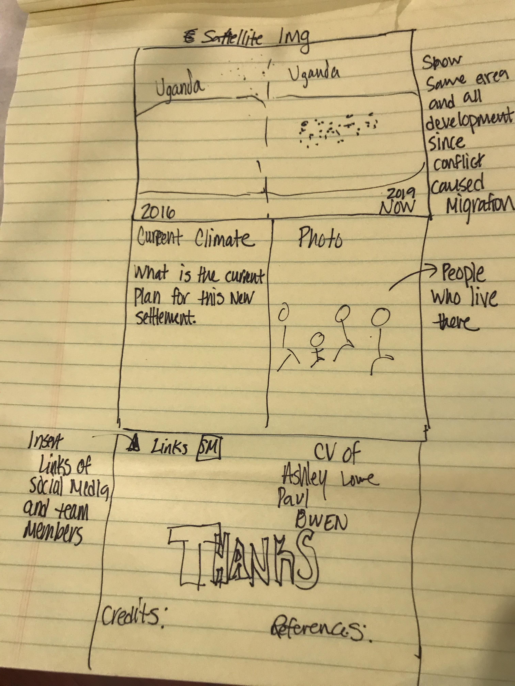
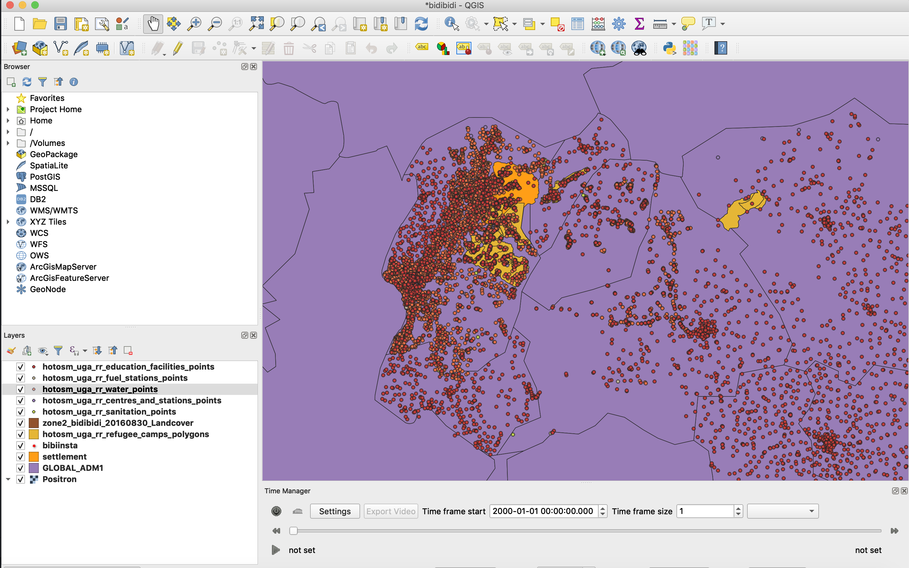

# Title : [Bidi Bidi Refugee Settlement Camp](https://loweas.github.io/bidibidi/)

### Project Description and Goal:
Bidi Bidi is a refugee camp is located in northern Uganda mostly made up of South Sudanese seeking refugee from the South Sudanese civil war which began in 2013. The peak of the war occured in 2016 and this is when the greatest amount of refugees migrated to the camp. For a brief time in 2017 it is the largest refugee settlement in the world. This project will focus on the tchanging langscape in Bidi Bidi. The immense amount of migratation changed the lanscape over a short period of time. Our website will highlght these changes by both maps, satellite images at different time periods and the changing sense of plae throught use of a wordcloud.  Our overall goal for the project is to synthesize changes in the Bidibidi camp (origins, development, current trends, predictions).

### The Description (Technical Summary) :
 First the project will give some background on the situation and how it arised, placing it into an historical context.
 Next sections we will show the changing landscape due to those conflicts.
Thirdly, we will have a section dedicated to the current social media indicators people are using to share stories with in the camp. This indicators will included Instagram data such as #bidibidi (this tag will need to be parsed with other tags to correctly identify the camp), #bidibidirefugeesettlement, and the location ID tag : 1281867775213393. From this data we can create wordclouds to express an idea of place and highlight photos with large engagement (likes and Comments).  Also, I would like to explore the API of twitter to see how to incorporate some of other social media platforms.

### Rough Sketched-Out Idea

### Design Scheme
Our final project, ended up a lot like what we scetched out. An introduction video, historical context, showing the migration flows, use of a webmap slider, and finally a wordcloud and other info on Social Media data.
#### Interface Design:
The current direction is a story-map visualization which will follow the structure layer as :
The Setup, - Historical
Confrontation and - Current Data
The Resolution - Current Social Media Involvement. (possibly predictions for the future of the camp, extrapolate on data trends from the previous section)

Examples :

[#StandingRock](https://winkyt.github.io/standwithstandingrock/)

[The Uprooted](http://storymaps.esri.com/stories/2016/the-uprooted/index.html)

[On The Front Lines of Famine](https://storymaps.esri.com/stories/2017/hunger-crisis/index.html)

### The Data:
#### QGIS Screen

Data | Data Source | Website |
----|-----------|---------|
Uganda | The Humanitarian Data Exchange | https://data.humdata.org/group/uga |
Instagram Data | Instagram | https://www.instagram.com/explore/tags/bidibidirefugeesettlement/ https://www.instagram.com/explore/tags/bidibidi/ https://www.instagram.com/explore/location/1281867775213393/ |
Uganda Population | unhcr |https://data2.unhcr.org/api/population/get/timeseries?widget_id=84726&geo_id=220&sv_id=5&population_group=5071&frequency=day&fromDate=1900-01-01 https://data2.unhcr.org/api/population/get/sublocation?widget_id=84724&geo_id=220&sv_id=5&population_collection=5&forcesublocation=0&fromDate=1900-01-01|

#### Historical Context:
When introducing the project we will use historical data. Currently focusing on UNHCR likes to JSON but will update with more as data is found:
[Population Growth of Entire Region ](https://data2.unhcr.org/api/population/get/timeseries?widget_id=84726&geo_id=220&sv_id=5&population_group=5071&frequency=day&fromDate=1900-01-01)

#### Current Data:
For our second portion of our story we will use current data from UNHCR and link the JSON urls so the map can be updated in real time.
URL’s such as :
[Population Breakdown by District](https://data2.unhcr.org/api/population/get/sublocation?widget_id=84724&geo_id=220&sv_id=5&population_collection=5&forcesublocation=0&fromDate=1900-01-01)

#### Social Media:
I already scrapped Instagram JSON  data given in assets folder:

 #bidibidirefugeesettlement \
 #bidibidi \
1281867775213393

Working on locating surrounding Instagram locations IDs.

### Favicon

A [photo](https://pixabay.com/photos/uganda-peace-hand-nation-2132664/) listed for reuse.

### Applied Libraries
[D3](https://github.com/d3/d3/wiki/Gallery)
[C3](https://c3js.org/)
[leaflet](https://leafletjs.com/)
[DC](https://dc-js.github.io/dc.js/)
[jQCloud](https://github.com/mistic100/jQCloud)

#### Layout
[Webslides](https://webslides.tv/#slide=1)

### Credit

### Group Members:
 [Paul](https://github.com/mdbrawner)
 [Owen](https://github.com/MarkleyO)
 [Ashley](https://github.com/loweas)

### Acknowledgement
This project was possible by [GEOG 4/572: Geovisual Analytics](https://github.com/jakobzhao/geog4572) and the troubleshooting skills with [Bo Zhao](https://github.com/jakobzhao)

### Google Analytics also attached
